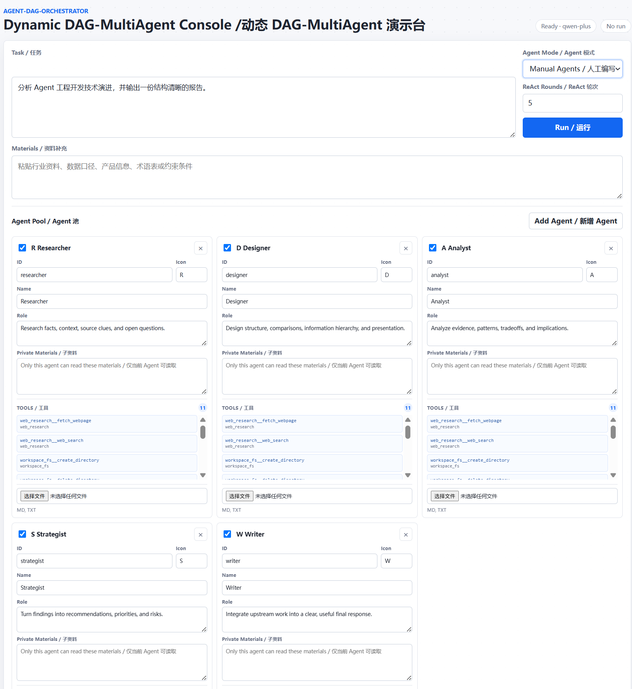
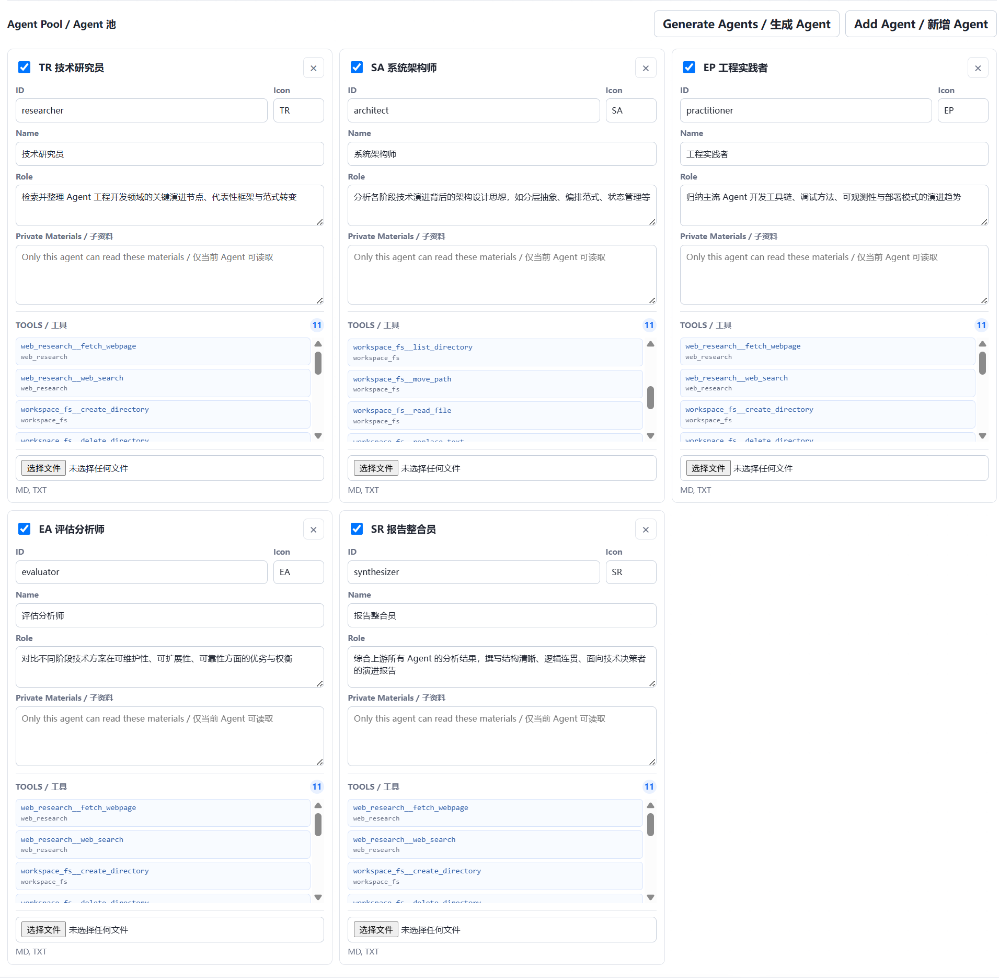
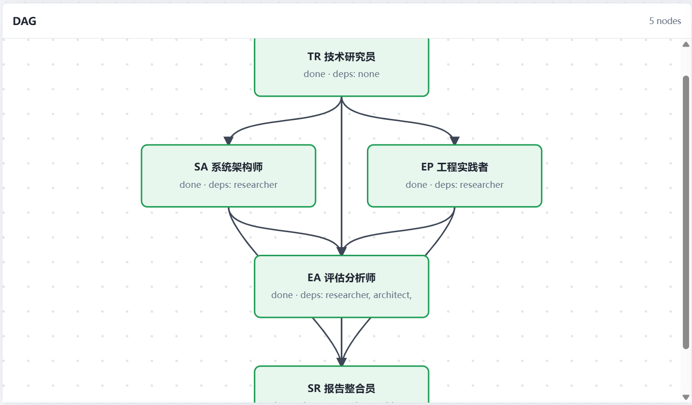
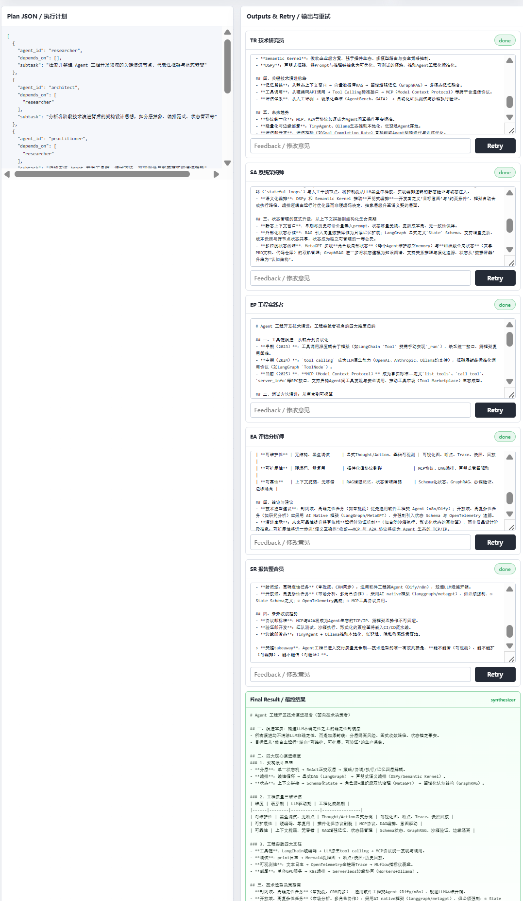

# 🚀 DAG-MultiAgent

一个动态 DAG 多 Agent 编排框架。

它做的事情很直接：不再是固定流程，而是由 LLM 动态编排，用户输入一个任务，系统可以先生成需要哪些 Agent，再生成这些 Agent 之间的依赖关系，最后按 DAG 并发执行。整个过程会推到前端，页面上能看到 DAG、事件流、执行计划和每个 Agent 的输出，并且支持编辑某个 Agent 的输出后单独重跑这个 Agent。

适用场景：
1. **研究分析类任务**
比如竞品分析、市场调研、行业报告、产品调研。  
可以拆成：资料收集、数据分析、观点提炼、结构设计、最终写作。部分节点能并行，最后再汇总。

2. **内容生产类任务**
比如多篇论文总结、商业报告、PPT 大纲、课程内容、营销方案。  
不同 Agent 可以负责资料、结构、风格、审校、最终输出，人可以对某个环节单独 Retry。
这类任务很适合拆成资料、结构、审校、成稿等多个协作节点。

3. **方案设计类任务**
比如产品方案、技术方案、增长方案、运营策略。  
这类任务通常不是一条死流程，而是需要根据任务动态决定：要不要调研、要不要评估风险、要不要生成视觉结构。

4. **评审和改写类任务**
比如代码 Review、文档 Review、简历优化、投标书优化。  
可以让不同 Agent 从不同角度看：逻辑、风险、表达、格式、业务价值，然后再合并。

5. **教学和演示类任务**
解释“多 Agent 到底怎么协作”。  
因为 DAG、事件流、Plan JSON、节点状态都可见，不是一个黑盒聊天窗口。

<p align="center">

</p>

## 🧠 一、项目简介

代替固定流程的多 Agent，这种会把执行顺序写死，比如固定串行：研究 -> 分析 -> 写作；

而本项目的核心在于**动态编排**多个 Agent，形成一个 DAG（有向无环图），并且**并发执行**。每个 Agent 内部可以多轮 ReAct，默认最多 5 轮。每轮结束后会抽取一份短记忆，下一轮只拿这份记忆继续跑。执行流程如下：

```text
用户任务 -> Designer：生成 Agent 池 -> Planner：编排 -> Scheduler：Kahn DAG 调度器 -> 串行/并行执行 -> 整合输出
```

其中，
- **Designer**：生成本任务的 Agent 池，例如本次任务需要三个 Agent，定义 Agent 的 Role、Task。
- **Planner**：根据 Agent 池，编排 Agent 之间的执行约束，例如 C-Agent 必须等待 A/B-Agent 结束才能执行。
- **Scheduler**：哪些节点的依赖已经满足。满足就提交执行，不满足就继续等。没有依赖的节点可以同时跑。
- **人机协作**：使用者可以自行评估 LLM 设计的 Multi Agent 架构是否合理，之后凭借个人经验去合理安排子 Agent，并且支持 Retry，单独审核或者修改子 Agent，让你的结果更符合预期。


## ✅ 二、项目技术核心

- **动态流程**：不是预定义 Agent，由 LLM 根据任务生成 Agent 池，动态编排。
- **编排可审计**：DAG 由 Planner 生成后，用户能直接增删节点、修改依赖、调整并行/串行关系，再交给 Scheduler 执行。
- **Multi Agent 可以手写，也可以自动生成**：模型生成的是可编辑草稿，运行前可以人工改职责、名称和 ID。
- **资料可以补充进去**：用户粘贴的背景资料、行业口径、数据说明会传给 Planner、子 Agent 和 Retry。
- **子 Agent 可以带私有资料**：每个 Agent 卡片都支持 PDF、DOCX、MD、TXT 资料，内容只传给对应 Agent，对外公开的 run snapshot 只返回数量，不返回原文。
- **并发执行**：没有依赖的节点会直接并行，不用被固定串行链路拖慢。
- **过程可见**：DAG 图、Plan JSON、事件流、节点状态、Agent 输出都会展示在前端。
- **支持 Retry**：用户可以编辑某个子 Agent 的输出，然后只重跑这个 Agent。
- **ReAct**：每个 LLM Agent 内部可以多轮 Thought / Action / Observation / Answer，默认最多 5 轮。
- **工具编排**：每个 Agent 的完整候选工具分别由 mode/actor 决定，运行时 Gateway 二次校验参数和权限。


<!-- - **每轮会抽取记忆**：ReAct 每轮结束后先压缩一份关键记忆，再传给下一轮，避免上下文越塞越长。 -->

## 🧩 三、核心流程

### 3.1 手动 Agent

你可以在前端直接编辑 Agent：

- `id`
- `name`
- `role`
- `icon`




### 3.2 Designer: 自动生成 Agent

开启 `Auto-create Agents` 后，**Designer** 会先根据任务生成一组临时 Agent 蓝图。蓝图只是 JSON，不是代码。

生成出来的 Agent 不会立刻执行。演示台会先把它们放进 Agent 池，用户可以改 `id`、`name`、`role`、`icon`，也可以删除或新增 Agent，再开始运行。

例如针对任务”分析 Agent 工程开发技术演进，并输出一份结构清晰的报告“，生成的 Agent 池。



### 3.3 公用/私有资料补充

演示台里的 `Materials / 资料补充` 会进入一次 run 的上下文。它不是单独给最终写作 Agent 的，Designer、Planner、每个子 Agent、以及单 Agent Retry 都能拿到。

每个 Agent 卡片也可以单独附带 `Private Materials / 子 Agent 私有资料`。这些内容只会传给对应 Agent，对外公开的 run snapshot 只返回数量，不返回原文。

适合放进去的内容包括：

- 行业背景
- 产品资料
- 内部数据口径
- 术语解释
- 品牌语气和写作约束

### 3.4 Planner/Scheduler：动态 DAG 调度 / 执行
Planner 根据用户问题和 Agent 池，生成各个 Agent 的任务并构建执行计划 DAG。
Scheduler 则使用在线 Kahn 风格的拓扑调度：

- 入度为 0 的节点先进入 ready 队列。
- 节点完成后，后继节点的依赖数减少。
- 依赖清空的节点立即提交到线程池。
- 如果出现环或无法推进，会产生 `run_stalled`。



### 3.5 ReAct Agent

LLM Agent 可以在节点内部进行多轮 ReAct：

```text
Thought -> Action -> Observation -> Answer
```

每一轮结束后都会抽取一份短记忆，下一轮只拿这份记忆继续跑。默认最多 5 轮，前端可以改。



## 😀 四、工具编排
每个 Agent 的完整候选工具分别由 mode/actor 决定，运行时 Gateway 二次校验参数和权限。

```text
Plugin 注册
  -> mode/actor 配置过滤
  -> 构建当前 ToolView
  -> 向模型注入全部候选 Tool Schema
  -> 模型返回 tool_calls
  -> Gateway 再次校验归属、参数和权限
  -> Plugin 执行及输出校验
```

## 🖥️ 五、演示台

前端是原生 HTML/CSS/JS，没有 React/Vite 构建链。

页面里可以看到：

1. 任务输入
2. 资料补充
3. Agent 模式选择：手动 Agent / 自动生成 Agent
4. Designer：自动 Agent 草稿编辑
5. Planner：DAG 图
6. Scheduler：执行事件
7. ReAct 最大轮次设置
8. Agent 输出和 Retry

## 🗂️ 六、项目结构
```text
.
├── common/                         # MCP 使用的通用日志组件
├── examples/
│   ├── ai_orchestrator/            # DAG Runtime、HTTP 服务与 Web 工作台
│   └── rag_mcp_example.cpp         # RAG-MCP 独立示例
├── mcp_client/                     # MCP Client 与 RAG 工具选择
├── mcp_server/                     # MCP Server、传输层和动态插件
├── orchestrator/                   # 独立分层记忆管理器
├── tests/                          # DAG、MCP、RAG-MCP、记忆管理测试
├── third_party/sqlite-vec/         # 知识库 MCP 插件依赖
└── docs/                           # MCP 文档、提示词和演示资料
```

## ⚙️ 七、快速启动

```bash
export QWEN_API_KEY=sk-your-key
export QWEN_API_URL=https://your-compatible-endpoint/compatible-mode/v1
./examples/ai_orchestrator/start_system.sh
```

默认访问地址为 `http://127.0.0.1:8000`。`QWEN_API_URL` 可以是兼容接口的 base URL，也可以直接是 `/chat/completions` URL；不设置时沿用 B 原有 DashScope 地址。可通过 `PORT` 修改端口。

停止服务：

```bash
./examples/ai_orchestrator/stop_system.sh
```

启动脚本会自动配置/构建 `build`，并只启动一个 Web 进程。运行日志统一位于项目根目录的 `log/`：`service.log` 保存 Web/DAG 命令行日志，`agent_<agent_id>.log` 保存对应 Agent 的 ReAct 对话，`planner.log` 和 `agent_designer.log` 保存 Planner/Agent Designer 的模型请求。每次启动脚本时会清空并重新创建 `log/` 内容；服务已在运行时不会清空当前日志。


## 🔍 八、项目 TODO

目前项目已经能跑通“动态编排 -> DAG 调度 -> 并发执行 -> 事件观察 -> 人工 Retry”这条主线。后续更值得补的是这些：

1. **持久化与崩溃恢复**  
   现在 `RunStore` 是单进程内存版，适合演示和原型。后续需要把 run、plan、事件、输出、上传资料落到 SQLite / PostgreSQL / Redis 这类存储里。服务重启后，至少要能查看历史 run；更进一步，可以恢复未完成的 run。

2. **前端优化**  
   当前前端优先保证可读、可改、可演示。后续可以加强 DAG 画布交互、节点详情、长输出折叠、上传资料管理、错误提示和移动端布局，让它更像一个真正可用的工作台。


## 📄 License

MIT

