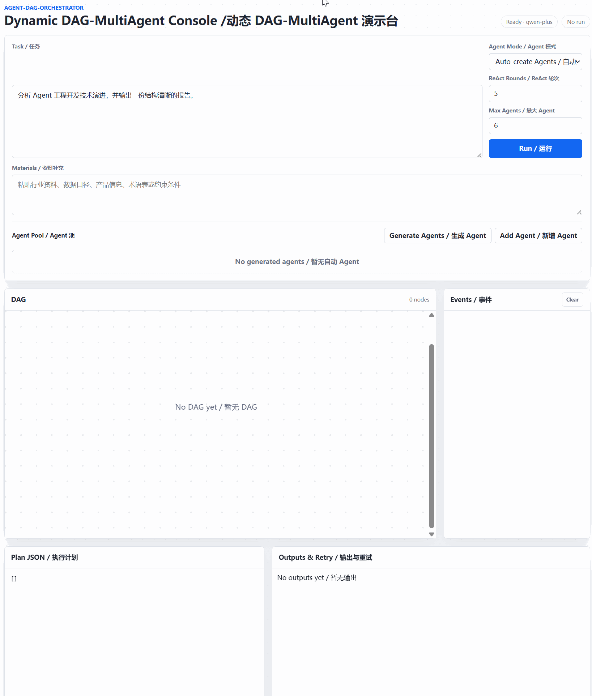

# DAG-MultiAgent

一个动态 DAG Multi Agent 编排框架。系统根据用户任务生成 Agent 池和依赖计划，在单进程内并发执行依赖已满足的节点，并通过 Web 工作台展示完整执行过程。


## 核心流程

```text
Browser
  -> HTTP API
  -> Agent Designer：生成任务级 Agent 草稿
  -> Planner：生成 agent_id / subtask / depends_on
  -> DAG Runtime：校验依赖与环
  -> Ready Nodes：同批异步并发执行
  -> ReAct Agent：Thought / Action / Observation / Answer
  -> Run Snapshot：计划、事件、状态与输出
```

- Agent Designer 根据任务生成 3～10 个临时 Agent，也支持用户手动维护 Agent 池。
- Planner 根据 Agent 池生成串行、并行或混合 DAG。
- Runtime 过滤未知/重复节点，检查非法依赖和环，并对无法推进的运行产生 `run_stalled` 事件。
- 同一批依赖已满足的节点通过 `std::async` 并发执行；下游节点只接收自身声明的上游输出。
- 每个节点最多执行 1～10 轮结构化 ReAct，默认 5 轮。

## Web 工作台

前端使用原生 HTML/CSS/JavaScript，无额外前端构建链。页面支持：

- 自动生成或手动编辑 Agent 池；
- 添加任务级公共资料和 Agent 级私有资料；
- 展示 DAG、Plan JSON、节点状态、事件流和输出；
- 编辑节点上一版输出并携带反馈单独 Retry；
- 每 400 ms 轮询 Run Snapshot，刷新运行状态。

私有资料只注入指定 Agent。公开 Run Snapshot 仅返回每个 Agent 的私有资料数量，不返回原文。

<p align="center">
  
</p>

## 保留的扩展模块

### MCP

`mcp_client/` 和 `mcp_server/` 作为独立能力保留：

- MCP Client 支持 STDIO、SSE、工具发现和工具调用；
- RAG-MCP 支持 Embedding 缓存、向量索引、Top-K 工具检索和工具校验；
- MCP Server 支持运行时动态库插件加载；
- 当前包含计算、服务器巡检、会议文件、知识库等插件。

这些能力当前不在 DAG Runtime 的执行链路中，后续将通过明确的工具适配层接入 ReAct Agent。

### 分层记忆管理器

`orchestrator/` 当前只保留 `ContextMemoryManager`：

- 即时工作上下文按 Token 预算保留最近消息；
- 较早消息通过可注入的 LLM 回调压缩为短期摘要；
- 从摘要中提取长期核心记忆并按 `context_id` 持久化为 JSON；
- 具备上下文 ID 文件名净化、记忆去重和 LLM 失败保护。

该管理器已独立构建和测试，但尚未接入 DAG Runtime。

## 构建

环境需要 CMake 3.20+、支持 C++20 的编译器，以及 CURL、jsoncpp、SQLite3、GoogleTest 和 RapidCheck。

```bash
cmake -S . -B build -DCMAKE_BUILD_TYPE=Debug
cmake --build build -j$(nproc)
```

只构建 DAG Web 主程序：

```bash
cmake --build build --target ai_orchestrator -j$(nproc)
```

如暂时不需要构建 MCP Server 及插件：

```bash
cmake -S . -B build -DDAG_MULTI_AGENT_BUILD_MCP_SERVER=OFF
```

## 启动 DAG Web 服务

```bash
export QWEN_API_KEY=sk-your-key
export QWEN_API_URL=https://your-compatible-endpoint/compatible-mode/v1
./examples/ai_orchestrator/start_system.sh
```

默认访问 `http://127.0.0.1:8000`。`QWEN_API_URL` 可填写兼容 Chat Completions 的 base URL 或完整 `/chat/completions` URL；可以通过 `QWEN_MODEL` 和 `PORT` 修改模型及监听端口。

停止服务：

```bash
./examples/ai_orchestrator/stop_system.sh
```

日志位于项目根目录 `log/`：

- `service.log`：HTTP 服务和 DAG Runtime 日志；
- `agent_designer.log`：Agent Designer 模型交互；
- `planner.log`：Planner 模型交互；
- `agent_<agent_id>.log`：对应 Agent 的 ReAct 交互。

## Web API

- `GET /health`：健康检查；
- `GET /api/agents`：获取默认 Agent 池；
- `POST /api/agents/draft`：生成可编辑 Agent 草稿；
- `POST /api/materials/parse`：解析 MD/TXT 资料；
- `POST /api/runs`：创建 DAG Run；
- `GET /api/runs/{run_id}`：获取 Run Snapshot；
- `POST /api/runs/{run_id}/agents/{agent_id}/retry`：重跑单个节点。

API Key 只从服务端环境变量读取，不下发到浏览器。

## 测试

```bash
ctest --test-dir build --output-on-failure
```

当前测试范围包括：

- DAG 依赖执行、计划降级、环检测、节点 Retry 和私有资料隔离；
- ReAct 日志与非法 UTF-8 输入保护；
- MCP Client、工具管理及异常降级；
- RAG-MCP 向量索引、缓存、检索和校验；
- 分层记忆压缩、长期记忆持久化和上下文隔离。

DAG 测试使用注入的确定性模型，不访问外部模型接口。

